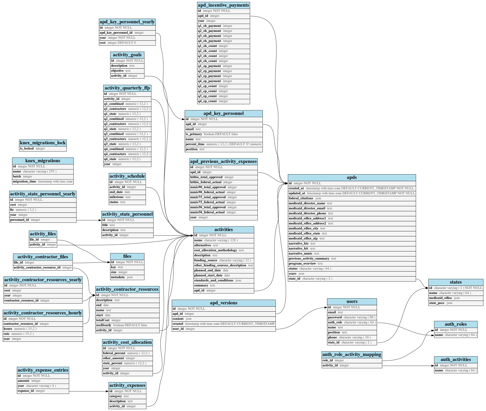

# Technical documentation

## Deployment

We are using [CircleCI](https://circleci.com/gh/18F/workflows/cms-hitech-apd) to
automate our tests as well as our deployments. We have some more
[documentation](deployment.md) that takes about our deployments in a little more
detail.

## Front end

The front end is built in [React](https://reactjs.org/), and uses the following
major libraries:

- [react-router](https://www.npmjs.com/package/react-router) for page routing
- [Redux](https://redux.js.org/) for internal state management
- [Webpack](https://webpack.js.org/) for bundling the app into a deliverable

(We have more detailed
[documentation about how our frontend build is configured](frontend-build.md),
too).

We use [Basscss](http://basscss.com/), an atomic CSS library, as the foundation
for styling, and add additional stylesheets where appropriate. We use
[PostCSS](https://github.com/postcss/postcss) to consolidate, transform (i.e.,
add vendor prefixes), and minify our CSS.

For testing, we use [Jest](https://facebook.github.io/jest/) as the test runner
and [Enzyme](http://airbnb.io/enzyme/) as a React renderer.

We have a [Storybook](https://github.com/storybooks/storybook) of some of our
components. That makes it easier to look at them, see how they work, and
understand where they should be used. The stories are located in the
[web/src/stories](https://github.com/18F/cms-hitech-apd/tree/master/web/src/stories)
directory.

## API

The API is built on [Express](https://expressjs.com/) using a
[PostgreSQL](https://www.postgresql.org/) database, and a handful of libraries:

- [bcryptjs](https://www.npmjs.com/package/bcryptjs) for secure hashing
- [client-session](https://www.npmjs.com/package/client-sessions) for secure
  cookie-based sessions
- [Passport](http://www.passportjs.org/) for authentication
- [Knex](http://knexjs.org/) for interacting with the database
- [Bookshelf.js](http://bookshelfjs.org) for managing database relationships

For testing, we use [node-tap](http://www.node-tap.org/) as the runner and
assertions, and [Sinon.JS](sinonjs.org) for mocking.

If you want to get a little deeper into how the API works, we have documentation
about:

- [configuring the back end app (environment variables and stuff like that)](api-configuration.md)
- [our authorization model](api-authorization.md)
- [how we handle authentication](api-authentication.md)

The API is also documented with [OpenAPI](https://www.openapis.org/). To see the
spec document, once the API is running, you can browse to its `/open-api`
endpoint. You can also use a hosted version of
[Swagger UI](http://petstore.swagger.io/) to get a nicer visualization.

## Database

The current database model is presented here. The `knex_*` tables are used to manage migration versions by our database interaction library.

## Testing

We also have [documentation about how to run tests](testing.md).

## Linting

We use [eslint](https://eslint.org/) to analyze our JavaScript files and find
patterns / code that doesn't adhere to our style rules. Our rules are based on
[AirBnb's style guide](https://github.com/airbnb/javascript) and
[Prettier](https://github.com/prettier/prettier).

## Accessibility

We use [tota11y](http://khan.github.io/tota11y/) to manually test our pages
during development for accessibility violations. We also utilize
[eslint-plugin-jsx-a11y](https://github.com/evcohen/eslint-plugin-jsx-a11y) for
automated checks for a11y rules within React components.
