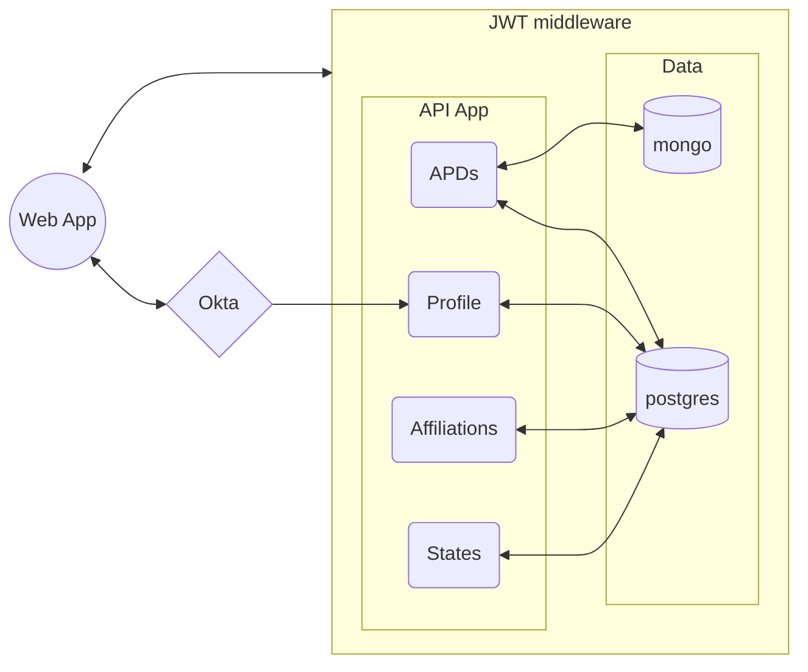

```mermaid
flowchart LR
    subgraph auth [JWT middleware]
        direction LR

        subgraph API [API App]
            direction LR
            apd(APDs)
            affiliations(Affiliations)
            states(States)
            me(Profile)
        end

        subgraph Data
            direction LR
            id1[(mongo)]
            id2[(postgres)]
        end
    end


    web((Web App)) <--> auth

    web <--> okta
    apd <--> id1
    apd <--> id2
    okta{Okta} --> me
    me <--> id2
    affiliations <--> id2
    states <--> id2
```
