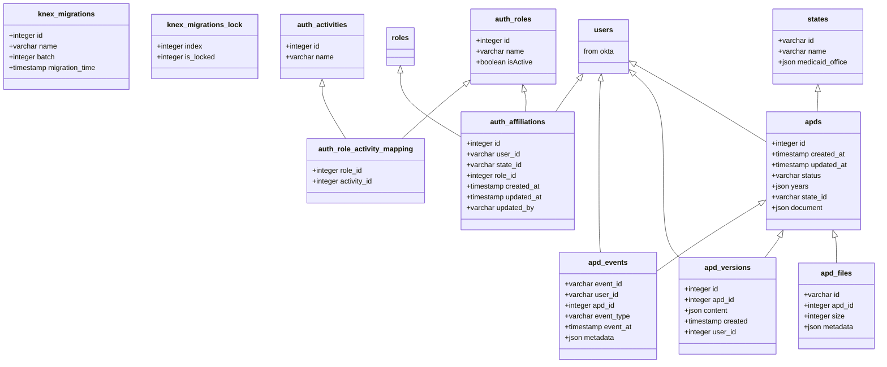

```mermaid
classDiagram
class knex_migrations {
  +integer id
  +varchar name
  +integer batch
  +timestamp migration_time
}
class knex_migrations_lock {
  +integer index
  +integer is_locked
}
class apds {
  +integer id
  +timestamp created_at
  +timestamp updated_at
  +varchar status
  +json years
  +varchar state_id
  +json document
}
class apd_versions {
  +integer id
  +integer apd_id
  +json content
  +timestamp created
  +integer user_id
}
class apd_files {
  +varchar id
  +integer apd_id
  +integer size
  +json metadata
}
class apd_events {
  +varchar event_id
  +varchar user_id
  +integer apd_id
  +varchar event_type
  +timestamp event_at
  +json metadata
}
class auth_activities {
  +integer id
  +varchar name
}
class auth_role_activity_mapping {
  +integer role_id
  +integer activity_id
}
class auth_roles {
  +integer id
  +varchar name
  +boolean isActive
}
class auth_affiliations {
  +integer id
  +varchar user_id
  +varchar state_id
  +integer role_id
  +timestamp created_at
  +timestamp updated_at
  +varchar updated_by
}
class users {
  from okta
}
class states {
  +varchar id
  +varchar name
  +json medicaid_office
}
states <|-- apds
users <|-- apds
apds <|-- apd_files
apds <|-- apd_versions
users <|-- apd_versions
apds <|-- apd_events
users <|-- apd_events
auth_roles <|-- auth_affiliations
users <|-- auth_affiliations
roles <|-- auth_affiliations
auth_activities <|-- auth_role_activity_mapping
auth_roles <|-- auth_role_activity_mapping
```
