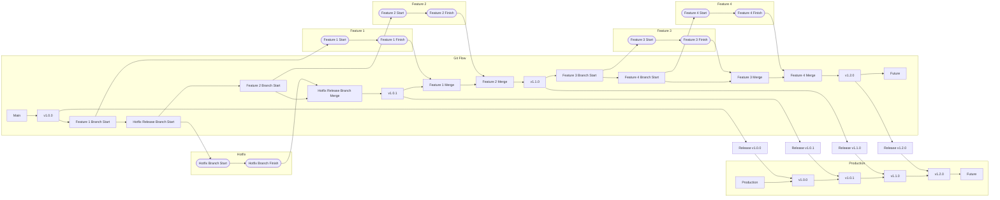

```mermaid
flowchart LR
  subgraph Production [Production]
    direction LR
    AA[Production] --> AB[v1.0.0] --> AC[v1.0.1] --> AD[v1.1.0] --> AE[v1.2.0] --> AF[Future]
  end

  subgraph Main [Git Flow]
    direction LR
    BA[Main] --> BB[v1.0.0] --> BC[Feature 1 Branch Start] --> BD[Hotfix Release Branch Start] --> BE[Feature 2 Branch Start] --> BF[Hotfix Release Branch Merge] --> BG[v1.0.1] --> BH[Feature 1 Merge] --> BI[Feature 2 Merge] --> BJ[v1.1.0] --> BL[Feature 3 Branch Start] --> BM[Feature 4 Branch Start] --> BN[Feature 3 Merge] --> BO[Feature 4 Merge] --> BK[v1.2.0] --> BP[Future]
  end

  subgraph Hotfix [Hotfix]
    BD --> HA([Hotfix Branch Start]) --> HB([Hotfix Branch Finish]) --> BF
  end

  subgraph Feature1 [Feature 1]
    BC --> CA([Feature 1 Start]) --> CB([Feature 1 Finish]) --> BH
  end

  subgraph Feature2 [Feature 2]
    BE --> DA([Feature 2 Start]) --> DB([Feature 2 Finish]) --> BI
  end

  subgraph Feature3 [Feature 3]
    BL --> EA([Feature 3 Start]) --> EB([Feature 3 Finish]) --> BN
  end

  subgraph Feature4 [Feature 4]
    BM --> FA([Feature 4 Start]) --> FB([Feature 4 Finish]) --> BO
  end

  ZW[Release v1.0.0]
  ZX[Release v1.0.1]
  ZY[Release v1.1.0]
  ZZ[Release v1.2.0]

  BB --> ZW --> AB
  BG --> ZX --> AC
  BJ --> ZY --> AD
  BK --> ZZ --> AE
```
